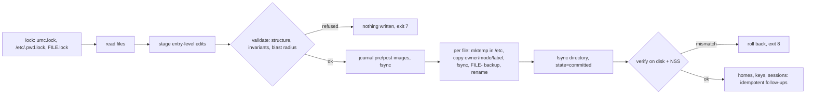

# UMC: User Management Console

[](https://github.com/syed-913/User_Management_Console/actions/workflows/ci.yml)


**Transactional local-account management for Linux, in one bash file.**

UMC creates, changes, offboards and audits local users and groups by editing
`/etc/passwd`, `/etc/shadow`, `/etc/group` and `/etc/gshadow` itself. It never
calls `useradd`, `usermod`, `userdel`, `groupadd`, `gpasswd`, `passwd`,
`chage`, `chpasswd` or `newusers`. It does this **as safely as shadow-utils
does**: the same two locking conventions, the same write-then-rename commit,
plus a journal that makes every change reviewable, reversible and
crash-recoverable.

```console
$ sudo umc plan -f new_hires.csv            # an HR export, as HR sent it
  Plan for new_hires.csv  (4 record(s), CSV)
    + user  ayesha.siddiqui (from e-mail)  groups=developers,docker  role=dev  temporary password
    + user  tom.becker (from e-mail)  groups=ops  role=admin  temporary password
    + user  lina.haddad (from e-mail)  role=contractor  temporary password  expires 2027-03-31
    + user  kenji.watanabe (from e-mail)  role=dev  temporary password  (created locked)
  Plan: 4 to add, 0 to change, 0 to offboard.  (nothing has been changed)

$ sudo umc apply -f new_hires.csv --yes     # one transaction: all or nothing
$ sudo umc apply -f new_hires.csv --yes     # idempotent
  = the system already matches new_hires.csv
$ sudo umc rollback --last                  # byte-for-byte undo
```

---

## Contents

[Who needs this](#who-needs-this) ·
[What is new](#what-is-actually-new-here) ·
[Highlights](#highlights) ·
[Quick start](#quick-start) ·
[Console](#the-console) ·
[Commands](#commands) ·
[Bulk onboarding](#bulk-onboarding-from-hr-exports) ·
[Safety model](#safety-model) ·
[Performance](#performance) ·
[Security](#security) ·
[Configuration](#configuration) ·
[Compatibility](#compatibility) ·
[Testing & evidence](#testing-and-evidence) ·
[Comparison](#how-umc-compares) ·
[Limitations](#limitations)

## Who needs this

In an enterprise, human identities belong in Active Directory or FreeIPA,
reached through SSSD. **Local accounts do not go away**, though, and they are
usually the least governed part of access management: created by hand, rarely
reviewed, and "audited" through shell history. UMC is for the places where
local accounts are unavoidable:

| Situation | How it is usually handled | What UMC adds |
|---|---|---|
| **Break-glass accounts**, the way in when the directory is down | created once by hand; nobody knows when they were last rotated | rotate, lock and unlock with a tamper-evident record of who did it; protected from deletion |
| **Air-gapped and regulated networks**: OT/ICS, defence, labs, payment zones | no directory, no Ansible control node, often no Python; change boards want to see the change first | one auditable file; `--dry-run` produces the exact diff to attach to the change request; rollback if it goes wrong |
| **Seasonal bulk onboarding**: university labs each semester, training classrooms, CTF events, contractor waves | a spreadsheet, a `useradd` loop and one shared default password | apply the export as it is; unique temporary passwords with a deadline; accounts that expire at term end; one-command offboarding |
| **Small organisations without an identity provider** | accounts drift from who actually works there; nobody knows who still has sudo | plan/apply straight from HR data; revoking only the access UMC granted; an access-review export |
| **Leavers and incidents** | removing access means remembering password, SSH keys, sudo, groups, sessions and cron | `umc user offboard` does all of it in one reversible, logged step |
| **Golden images, appliances, containers** | accounts baked in by ad-hoc scripts | `--root DIR`: the same transactional engine on an offline tree |
| **Audits** (CIS Benchmarks, ISO/IEC 27001 access control, PCI DSS requirement 8, SOX access reviews) | evidence assembled by hand | `umc audit` (CIS-mapped, JSON, CI exit codes) and `umc export` |

UMC coexists with a directory: it never touches directory accounts, checks NSS
before using a name or ID, and flushes `nscd`/`sssd` caches after a change.
**If every host is already joined to AD/FreeIPA and configuration management
covers the rest, UMC's role shrinks to break-glass and service accounts.**

## What is actually new here

Being feature-rich is not the same as being new, so here is the honest version.
**None of UMC's techniques is new on its own.** Write-then-rename commits come
from shadow-utils and databases, plan/apply from Terraform, idempotency from
Ansible, hash-chained logs from audit systems. What UMC adds is the
**combination**: database-style transactional guarantees and infrastructure-as-code
planning, applied to Linux's flat-file account databases, for hosts where the
usual tools cannot run. Among the tools and projects compared
[below](#how-umc-compares), none of them:

1. **treats a whole batch of account changes as one transaction**: validated,
   journaled, committed across all four files, reversible with `rollback`, and
   recovered automatically after a crash. shadow-utils replaces each file safely,
   but keeps no record from which a batch could be undone;
2. **checks its own blast radius**: an independent byte-level comparison
   refuses to commit any entry the operation did not declare. During
   development it caught a real bug in UMC ([DESIGN.md §14](docs/DESIGN.md#14-bugs-the-safety-nets-caught-during-development));
3. **honours both locking conventions** (shadow-utils' `FILE.lock` *and*
   glibc/PAM's `/etc/.pwd.lock`), and never rolls back over another program's
   write. Getting this wrong is a known pitfall; at least one reimplementation
   of shadow-utils tracks it as an open issue
   ([uutils/shadow#240](https://github.com/uutils/shadow/issues/240));
4. **turns raw HR exports into a reviewable plan for local accounts**: format
   inference, identity matching across monthly exports, mover-safe revocation
   of only the access it granted, onboarding deadlines;
5. **needs nothing but bash, coreutils and util-linux**, so it runs on the
   air-gapped host itself, and **proves each claim with a reproducible report**
   in [`evidence/`](evidence/README.md).

If you know a tool that already does all of this, please open an issue.

## Highlights

| | What it means | Proof |
|---|---|---|
| **Atomic, crash-safe commits** | temp file in the target directory, owner/mode/SELinux label copied, fsync, rename, directory fsync; interrupted commits are rolled back on the next run | [E-05](evidence/E-05-crash-consistency.md) 400 random `SIGKILL`s · [E-06](evidence/E-06-disk-full.md) disk full at every point |
| **Safe next to other tools** | takes shadow-utils' `FILE.lock` *and* glibc/PAM's `/etc/.pwd.lock` before reading | [E-07](evidence/E-07-concurrency.md) UMC + `useradd` + `chpasswd` in parallel: 0 lost updates |
| **Refuses what it did not intend** | every change declares its targets; an independent byte comparison refuses anything else | [E-10](evidence/E-10-blast-radius.md) |
| **Idempotent** | every command converges; the second `apply` changes nothing | [E-08](evidence/E-08-idempotency.md) |
| **Reversible** | journal with pre/post images, `rollback`, rollback of a rollback | [E-09](evidence/E-09-rollback.md) |
| **Reads HR exports as they are** | any delimiter, BOM, UTF-16, CRLF, nested JSON, HR column names and status words; shows its interpretation first | [E-14](evidence/E-14-messy-hr-files.md) |
| **Onboarding with a deadline** | unique temporary passwords that must be changed within 24 h, or the account locks | [E-15](evidence/E-15-onboarding-deadline.md) |
| **Joiner / mover / leaver** | roles, HR-attribute rules, revoking only the access UMC granted, reversible offboarding before deletion | [tests](tests/integration/bulk.bats) |
| **Compliance audit** | 24 checks mapped to CIS Benchmark controls; `--fail-on` for CI | [E-12](evidence/E-12-audit.md) |
| **Tamper-evident audit log** | hash-chained JSON Lines plus structured journald fields | [E-13](evidence/E-13-tamper-evident-log.md) |
| **Efficient in bulk** | 1,000 users with hashed passwords and homes: **~4.2× faster than a `useradd` loop** with the same hashing (2.1× on one core); slower for a single user. [Honest numbers below](#performance) | [E-11](evidence/E-11-performance.md) |

Every row links to a report generated by a script in [`poc/`](poc/) that anyone
can re-run in a throw-away container. See the [evidence index](evidence/README.md).

## Quick start

```bash
# install (root-owned, so nobody else can change what root runs)
sudo install -o root -g root -m 0755 umc.sh /usr/local/sbin/umc

sudo umc doctor                                         # what this host supports
sudo umc                                                # the interactive console
sudo umc --dry-run user create alice --groups developers     # exact diff, nothing written
sudo umc user create alice --groups developers --generate-password
sudo umc history                                        # every change, who, when
sudo umc rollback --last                                # undo it
```

Requirements: bash ≥ 4.4, coreutils, util-linux, openssl (1.1.1+), tar, gzip.
Optional tools are detected at runtime and reported by `umc doctor`: `visudo`
(sudo rules), `ssh-keygen` (key validation), `pwscore` (system password
policy), `mkpasswd` (yescrypt), `iconv` (UTF-16 imports), `restorecon`
(SELinux), `python3`/`perl` (`lckpwdf` on util-linux < 2.41).

## The console

Running `umc` on a terminal opens the menu-driven console:

```
████████████████████████████████████████████████████████████████████████████████
█              U S E R   M A N A G E M E N T   C O N S O L E                   █
█          [ VERSION 2.0.0 ]   [ ADMIN: ALICE ]   [ HOST: web-01 ]             █
████████████████████████████████████████████████████████████████████████████████
   [1] USER ACTIONS           →  create, modify, passwords, lock, keys, offboard
   [2] GROUPS & SUDO          →  groups, members, validated sudo rules
   [3] SECURITY & AUDIT       →  CIS-mapped audit, policy, access review
   [4] BULK OPERATIONS        →  any CSV/JSON: inspect, plan, apply
   [5] SAFETY NET & LOGS      →  history, undo, locks, audit log, doctor
   [D] DRY-RUN MODE           →  currently OFF: preview every change
   [0] QUIT CONSOLE           →  nothing to clean up: no locks are held
```

Every menu action runs the same command the CLI does and prints it
(`CLI equivalent: umc user lock alice --reason ...`). The console holds no
lock while you browse, and closes after 15 idle minutes.

## Commands

```text
USERS     user create|modify|passwd|lock|unlock|expire|aging|offboard|reinstate|delete|show|list
          user key add|remove|list
GROUPS    group create|delete|add-member|remove-member|show|list
SUDO      sudo grant|revoke|list            (validated with visudo, 0440, atomic)
BULK      import inspect FILE · plan -f FILE · apply -f FILE [--prune] · export
SECURITY  audit [--fail-on SEVERITY] · policy show|set · sweep [--install-timer]
SAFETY    history · show TXN · rollback TXN|--last · recover · locks · log show|verify · doctor

GLOBAL    --root DIR  --dry-run  --yes  --json  --quiet  --no-color  --config FILE  --debug
```

`umc help` and `umc help user|group|sudo` list every option.

| Exit code | Meaning |
|---|---|
| 0 | success, or nothing to do (already in the requested state) |
| 1 | failure (the message says what state the system is in) |
| 2 | usage error |
| 3 | invalid input or policy violation (nothing written) |
| 4 | account files locked by another program |
| 5 | not found |
| 6 | conflict (exists with other settings, protected account, last admin...) |
| 7 | integrity check refused the change (nothing written) |
| 8 | committed, then verification failed and it was rolled back automatically |
| 10 | `audit --fail-on`: findings at or above the threshold |

Secrets are never taken on the command line (`ps` would show them):
`printf '%s\n' "$pw" | umc user passwd bob --password-stdin`.

## Bulk onboarding from HR exports

```bash
sudo umc import inspect export.csv    # how UMC read it: encoding, delimiter, column mapping, problems
sudo umc plan -f export.csv           # what would change
sudo umc apply -f export.csv          # do it, in one transaction
```

- **Any layout.** Comma, semicolon (European Excel), tab or pipe; UTF-8 with or
  without BOM, UTF-16, Windows-1252; CRLF; quoted fields; JSON with the records
  anywhere (`{"data":{"employees":[...]}}`), nested keys flattened.
- **Column names as HR writes them.** "E-Mail Address", "Given Name",
  "Contract End", "Employment Status"... are mapped through an alias table.
  Override with `--map 'Login ID=username'` and save a mapping with
  `--save-profile hr` / reuse it with `--profile hr`.
- **User names** come from the file, the e-mail address, or a pattern
  (`first.last`). Accented names are transliterated (`José Núñez` →
  `jose.nunez`); names that cannot be transliterated are flagged, never mangled.
- **Identity.** Employee ID, then e-mail, then user name: next month's export
  updates the same people even if a surname changed.
- **Status words.** `Active` → present, `On leave` → locked,
  `Terminated` → offboarded.
- **Access from HR attributes.** `/etc/umc/rules.conf`, e.g.
  `department=Engineering -> role=dev`. When someone moves, UMC revokes the
  groups **it** granted and never touches manual grants.
- **All-or-nothing.** One bad row stops the import; `--skip-invalid` applies the
  rest and writes a rejects report.
- **Onboarding.** Each new user gets a unique temporary password (e.g.
  `Kx7m-p9Qr-T4wz`, ~70 bits) in a root-only credential slip. It must be changed
  at first login, within 24 h; `umc sweep` (a 15-minute systemd timer:
  `umc sweep --install-timer`) locks accounts that miss the deadline and erases
  their slip entries. Users with SSH keys get no password at all.

## Safety model



- Nothing is written before every check has passed. Errors say **what failed,
  what state the system is in, and what to do**.
- Signals are ignored during the renames, so Ctrl-C cannot split a commit. A
  `SIGKILL` or a power cut is recovered from the journal on the next run.
- Lockout guards: root, the admin running UMC, the last sudo-capable
  administrator, system accounts and a configurable break-glass list are
  protected. Offboarding (reversible) comes before deletion (explicit, archived first).

Details: [docs/DESIGN.md](docs/DESIGN.md).

## Performance

UMC is not faster *code*: the heavy lifting (hashing, copying home
directories) is done by C programs in both cases. It does **less repeated
work**. A `useradd` loop starts a process, takes the locks and rewrites all
four account files, plus their backups, **once per user**; UMC does that
**once per batch**, and spreads the hashing and home directories over the CPU
cores. From [E-11](evidence/E-11-performance.md), 1,000 users with the same
hashing algorithm on both sides (12-core container):

| 1,000 users | UMC `apply` | `useradd` loop + `chpasswd` | `newusers` |
|---|---|---|---|
| SHA-512, 12 cores | **5.1 s** | 21.6 s | - |
| SHA-512, 1 core | **11.5 s** | 24.6 s | - |
| yescrypt, 12 cores | **7.3 s** | 31.4 s | 17.2 s |
| yescrypt, 1 core | 24.4 s | 31.3 s | **17.0 s** |
| **a single user** | 389 ms | **39 ms** | - |

Where UMC loses, and why: on one core with yescrypt, `newusers` hashes inside
its own process while UMC starts one `mkpasswd` per password. For a single
user, UMC's fixed safety work (journal, validation, NSS verification, audit
record) makes it about 10× slower than `useradd` (389 ms against 39 ms in the published run). So use `apply` for batches, not a
loop of `user create`.

## Security

- **Hardened runtime:** fixed `PATH`, `LC_ALL=C`, `umask 077`, `IFS`;
  `umc.conf` is parsed (never `source`d) and must be root-owned.
- **No secrets in argv, here-strings, logs or JSON**; hashes validated before
  writing; `ENCRYPT_METHOD` honoured (SHA-512, yescrypt).
- **Writes inside home directories run as the user** (`setpriv`), so planted
  symlinks cannot redirect them.
- **Lock means lock:** `!` *and* account expiry, because a `!` alone still admits SSH keys.
- **Audit:** `umc audit` runs 24 checks (UID 0, empty passwords, duplicates,
  file permissions, weak hashes, NOPASSWD sudo, locked accounts that still
  have keys...), mapped to CIS Benchmark control titles, as text or JSON.
- **Audit trail:** `journalctl UMC_ACTION=user.offboard` and
  `/var/log/umc/audit.jsonl` (hash-chained, `umc log verify`).
- v1's issues and their fixes: [security advisory](docs/SECURITY-ADVISORY-v1.md).
  Threat model: [DESIGN.md §12](docs/DESIGN.md#12-threat-model).

## Configuration

All optional. Defaults come from the host's `login.defs` and `/etc/default/useradd`.

| File | Purpose | Example |
|---|---|---|
| `/etc/umc/umc.conf` | naming policy, home roots, protected accounts, retention, deadlines | [examples/umc.conf](examples/umc.conf) |
| `/etc/umc/roles.d/NAME.conf` | role → groups, shell, sudo, expiry | [dev](examples/roles.d/dev.conf) · [admin](examples/roles.d/admin.conf) · [contractor](examples/roles.d/contractor.conf) |
| `/etc/umc/skel.d/ROLE/` | extra skeleton files per role | [examples/skel.d/dev](examples/skel.d/dev) |
| `/etc/umc/rules.conf` | HR attribute → role/groups | [examples/rules.conf](examples/rules.conf) |
| `/etc/umc/import-profiles/NAME.map` | saved column mappings | created by `--save-profile` |

`--root DIR` makes every command act on an offline tree (a golden image, a
chroot, a test fixture) instead of `/`.

## Compatibility

| Distribution | Container tests (129) | VM on libvirt/KVM, 133 tests ([E-16](evidence/E-16-vm-end-to-end.md)) | Notes |
|---|---|---|---|
| RHEL 9 (UBI 9) | ✅ | not run: the box needs a Red Hat subscription | box `generic/rhel9` |
| RHEL 8 (UBI 8) | ✅ | - | bash 4.4: the oldest supported |
| Rocky Linux 9 | ✅ | ✅ SELinux enforcing | `lckpwdf` via python3 |
| AlmaLinux 9 | ✅ | ✅ SELinux enforcing | |
| Fedora 42 | ✅ | - | minimal image has no python3/perl: `lckpwdf` interop reported as unavailable |
| Debian 12 | ✅ | ✅ | `lckpwdf` via perl |
| Debian 13 | ✅ | ✅ | `flock --fcntl` (util-linux 2.41), tmpfs `/tmp` |
| Ubuntu 22.04 | ✅ | ✅ | |
| Ubuntu 24.04 | ✅ | ✅ | |

VM results are from one run of `tests/vagrant/verify.sh libvirt` on 2026-09-30
(UMC `d570975`, vagrant-libvirt 0.12.2): the container suite plus four end-to-end
tests (SELinux labels, SSH key login refused by a UMC lock, journald, systemd
timer). Two tests skip on every VM, as designed: one checks the "no systemd"
error path, and either the SELinux test (no SELinux on Debian/Ubuntu) or the
yescrypt test (no yescrypt `mkpasswd` on the RHEL family) does not apply.

The [Vagrantfile](Vagrantfile) defines pinned boxes for **libvirt, VirtualBox,
VMware, Hyper-V and Parallels**, and records the boxes that were tried and do
not boot. `tests/vagrant/verify.sh --smoke <provider>` boots each one, runs a
smoke test and prints which boxes work for you. Either mode destroys every VM
and removes every box, image volume and network the run added (a network named
with `--keep-network` stays defined, stopped); anything that existed before is
left as it was.

## Testing and evidence

```bash
tests/run-in-docker.sh                 # 129 tests in a throw-away Debian 12 container
tests/run-in-docker.sh --all           # the 9-distribution matrix (what CI runs)
tests/vagrant/verify.sh libvirt rocky9   # boot a VM, run everything incl. SELinux/sshd end-to-end, clean up
poc/run.sh                             # regenerate every evidence report
```

- **Unit:** validators, JSON/CSV readers, dates, transliteration, password
  generation and policy, CSV formula escaping.
- **Integration:** every command against throw-away `--root` trees, including
  crash recovery (a real `SIGKILL` mid-commit) and log tampering.
- **Live:** the container's own `/etc`, real `useradd`/`chpasswd`/NSS.
- **End-to-end (VM):** SELinux labels, SSH logins before and after a lock, journald, systemd timer.
- Every v1 finding that still applies has a regression test named after it
  (`F-01` … `F-33`; F-20's feature was removed), so a reviewer can go from the
  [CHANGELOG](CHANGELOG.md) straight to the test.
- `tests/run.sh` refuses to run outside a container or test VM, because the
  live tests rewrite `/etc`.

## How UMC compares

| | UMC | typical `useradd` + CSV scripts | `newusers` | Ansible `user` | systemd-sysusers | FreeIPA / AD |
|---|---|---|---|---|---|---|
| Dry run with exact diff | ✅ | ❌ | ❌ | ✅ (check mode) | ❌ | - |
| One transaction for a batch | ✅ | ❌ | ❌ | ❌ | ✅ | - |
| Rollback / crash recovery | ✅ | ❌ | ❌ | ❌ | ❌ | backups |
| Idempotent | ✅ | ❌ | ❌ | ✅ | ✅ | - |
| Reads arbitrary HR exports | ✅ | fixed CSV | fixed format | ❌ | ❌ | via connectors |
| Lifecycle (offboard → delete) | ✅ | ❌ | ❌ | partial | ❌ | ✅ |
| Local audit + CIS mapping | ✅ | ❌ | ❌ | ❌ | ❌ | partial |
| Needs an agent / runtime | no (bash) | no | no | Python + control node | systemd | servers |
| Human identities at scale | no, local only | no | no | per host | system accounts only | ✅ |

## Limitations

- Local accounts only: it does not write to LDAP/AD/FreeIPA, and it does not
  change PAM stacks (it reads `pwquality.conf` and can set its values).
- Per host by design. For fleets, run it through Ansible or `ssh`
  (`umc apply -f -` reads a manifest from stdin).
- `.xlsx` is not read directly: save as CSV.
- Tamper evidence is local: root can rewrite the chain. Forward journald
  off the host for real protection.
- VMs were verified on libvirt/KVM only. The VirtualBox, VMware, Hyper-V and
  Parallels boxes are pinned from the public catalogue but have not been booted
  here: `tests/vagrant/verify.sh --smoke <provider>` checks them on yours.
  RHEL 9 needs a subscription and was not run.

## Project history

v1 was an interactive script written as a learning project. A review before
v2 found 33 issues, some serious (see the [advisory](docs/SECURITY-ADVISORY-v1.md)
and [CHANGELOG](CHANGELOG.md)). v2 is a rewrite that keeps v1's goals and look,
and proves its claims with tests and reproducible evidence.

## License

[MIT](LICENSE) © 2026 syed-913
