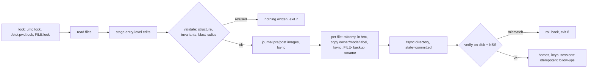

# UMC: User Management Console

[](https://github.com/syed-913/User_Management_Console/actions/workflows/ci.yml)


**Transactional local-account management for Linux, in one bash file.**

UMC creates, changes, offboards and audits local users and groups by editing
`/etc/passwd`, `/etc/shadow`, `/etc/group` and `/etc/gshadow` itself. It never
calls `useradd`, `usermod`, `userdel`, `groupadd`, `gpasswd`, `passwd`,
`chage`, `chpasswd` or `newusers`. It does this **as safely as shadow-utils
does**: the same two locking conventions, the same write-then-rename commit,
plus a journal that makes every change reviewable, reversible and
crash-recoverable.

```console
$ sudo umc plan -f new_hires.csv            # an HR export, as HR sent it
  Plan for new_hires.csv  (4 record(s), CSV)
    + user  ayesha.siddiqui (from e-mail)  groups=developers,docker  role=dev  temporary password
    + user  tom.becker (from e-mail)  groups=ops  role=admin  temporary password
    + user  lina.haddad (from e-mail)  role=contractor  temporary password  expires 2027-03-31
    + user  kenji.watanabe (from e-mail)  role=dev  temporary password  (created locked)
  Plan: 4 to add, 0 to change, 0 to offboard.  (nothing has been changed)

$ sudo umc apply -f new_hires.csv --yes     # one transaction: all or nothing
$ sudo umc apply -f new_hires.csv --yes     # idempotent
  = the system already matches new_hires.csv
$ sudo umc rollback --last                  # byte-for-byte undo
```

---

## Contents

[Why](#why-umc-exists) ·
[Highlights](#highlights) ·
[Quick start](#quick-start) ·
[Console](#the-console) ·
[Commands](#commands) ·
[Bulk onboarding](#bulk-onboarding-from-hr-exports) ·
[Safety model](#safety-model) ·
[Security](#security) ·
[Configuration](#configuration) ·
[Compatibility](#compatibility) ·
[Testing & evidence](#testing-and-evidence) ·
[Comparison](#how-umc-compares) ·
[Limitations](#limitations)

## Why UMC exists

In an enterprise, human identities belong in Active Directory or FreeIPA,
reached through SSSD. **Local accounts do not go away**, though: break-glass
accounts, service accounts, air-gapped and OT hosts, appliances, golden images,
and every host before it joins a domain. UMC manages those. It is designed to
coexist with SSSD: it never touches directory accounts, checks NSS before
using a name or ID, and flushes `nscd`/`sssd` caches after a change.

## Highlights

| | What it means | Proof |
|---|---|---|
| **Atomic, crash-safe commits** | temp file in the target directory, owner/mode/SELinux label copied, fsync, rename, directory fsync; interrupted commits are rolled back on the next run | [E-05](evidence/E-05-crash-consistency.md) 400 random `SIGKILL`s · [E-06](evidence/E-06-disk-full.md) disk full at every point |
| **Safe next to other tools** | takes shadow-utils' `FILE.lock` *and* glibc/PAM's `/etc/.pwd.lock` before reading | [E-07](evidence/E-07-concurrency.md) UMC + `useradd` + `chpasswd` in parallel: 0 lost updates |
| **Refuses what it did not intend** | every change declares its targets; an independent byte comparison refuses anything else | [E-10](evidence/E-10-blast-radius.md) |
| **Idempotent** | every command converges; the second `apply` changes nothing | [E-08](evidence/E-08-idempotency.md) |
| **Reversible** | journal with pre/post images, `rollback`, rollback of a rollback | [E-09](evidence/E-09-rollback.md) |
| **Reads HR exports as they are** | any delimiter, BOM, UTF-16, CRLF, nested JSON, HR column names and status words; shows its interpretation first | [E-14](evidence/E-14-messy-hr-files.md) |
| **Onboarding with a deadline** | unique temporary passwords that must be changed within 24 h, or the account locks | [E-15](evidence/E-15-onboarding-deadline.md) |
| **Joiner / mover / leaver** | roles, HR-attribute rules, revoking only the access UMC granted, reversible offboarding before deletion | [tests](tests/integration/bulk.bats) |
| **Compliance audit** | 23 checks mapped to CIS Benchmark controls; `--fail-on` for CI | [E-12](evidence/E-12-audit.md) |
| **Tamper-evident audit log** | hash-chained JSON Lines plus structured journald fields | [E-13](evidence/E-13-tamper-evident-log.md) |
| **Fast in bulk** | 1,000 users with homes and hashed passwords: **5.2 s**, vs 21.5 s for a `useradd` loop and 16.7 s for `newusers` (same container, 12 CPUs) | [E-11](evidence/E-11-performance.md) |

Every row links to a report generated by a script in [`poc/`](poc/) that anyone
can re-run in a throw-away container. See the [evidence index](evidence/README.md).

## Quick start

```bash
# install (root-owned, so nobody else can change what root runs)
sudo install -o root -g root -m 0755 umc.sh /usr/local/sbin/umc

sudo umc doctor                                         # what this host supports
sudo umc                                                # the interactive console
sudo umc --dry-run user create alice --groups developers     # exact diff, nothing written
sudo umc user create alice --groups developers --generate-password
sudo umc history                                        # every change, who, when
sudo umc rollback --last                                # undo it
```

Requirements: bash ≥ 4.4, coreutils, util-linux, openssl (1.1.1+), tar, gzip.
Optional tools are detected at runtime and reported by `umc doctor`: `visudo`
(sudo rules), `ssh-keygen` (key validation), `pwscore` (system password
policy), `mkpasswd` (yescrypt), `iconv` (UTF-16 imports), `restorecon`
(SELinux), `python3`/`perl` (`lckpwdf` on util-linux < 2.41).

## The console

Running `umc` on a terminal opens the menu-driven console:

```
████████████████████████████████████████████████████████████████████████████████
█              U S E R   M A N A G E M E N T   C O N S O L E                   █
█          [ VERSION 2.0.0 ]   [ ADMIN: ALICE ]   [ HOST: web-01 ]             █
████████████████████████████████████████████████████████████████████████████████
   [1] USER ACTIONS           →  create, modify, passwords, lock, keys, offboard
   [2] GROUPS & SUDO          →  groups, members, validated sudo rules
   [3] SECURITY & AUDIT       →  CIS-mapped audit, policy, access review
   [4] BULK OPERATIONS        →  any CSV/JSON: inspect, plan, apply
   [5] SAFETY NET & LOGS      →  history, undo, locks, audit log, doctor
   [D] DRY-RUN MODE           →  currently OFF: preview every change
   [0] QUIT CONSOLE           →  nothing to clean up: no locks are held
```

Every menu action runs the same command the CLI does and prints it
(`CLI equivalent: umc user lock alice --reason ...`). The console holds no
lock while you browse, and closes after 15 idle minutes.

## Commands

```text
USERS     user create|modify|passwd|lock|unlock|expire|aging|offboard|reinstate|delete|show|list
          user key add|remove|list
GROUPS    group create|delete|add-member|remove-member|show|list
SUDO      sudo grant|revoke|list            (validated with visudo, 0440, atomic)
BULK      import inspect FILE · plan -f FILE · apply -f FILE [--prune] · export
SECURITY  audit [--fail-on SEVERITY] · policy show|set · sweep [--install-timer]
SAFETY    history · show TXN · rollback TXN|--last · recover · locks · log show|verify · doctor

GLOBAL    --root DIR  --dry-run  --yes  --json  --quiet  --no-color  --config FILE  --debug
```

`umc help` and `umc help user|group|sudo` list every option.

| Exit code | Meaning |
|---|---|
| 0 | success, or nothing to do (already in the requested state) |
| 1 | failure (the message says what state the system is in) |
| 2 | usage error |
| 3 | invalid input or policy violation (nothing written) |
| 4 | account files locked by another program |
| 5 | not found |
| 6 | conflict (exists with other settings, protected account, last admin...) |
| 7 | integrity check refused the change (nothing written) |
| 8 | committed, then verification failed and it was rolled back automatically |
| 10 | `audit --fail-on`: findings at or above the threshold |

Secrets are never taken on the command line (`ps` would show them):
`printf '%s\n' "$pw" | umc user passwd bob --password-stdin`.

## Bulk onboarding from HR exports

```bash
sudo umc import inspect export.csv    # how UMC read it: encoding, delimiter, column mapping, problems
sudo umc plan -f export.csv           # what would change
sudo umc apply -f export.csv          # do it, in one transaction
```

- **Any layout.** Comma, semicolon (European Excel), tab or pipe; UTF-8 with or
  without BOM, UTF-16, Windows-1252; CRLF; quoted fields; JSON with the records
  anywhere (`{"data":{"employees":[...]}}`), nested keys flattened.
- **Column names as HR writes them.** "E-Mail Address", "Given Name",
  "Contract End", "Employment Status"... are mapped through an alias table.
  Override with `--map 'Login ID=username'` and save a mapping with
  `--save-profile hr` / reuse it with `--profile hr`.
- **User names** come from the file, the e-mail address, or a pattern
  (`first.last`). Accented names are transliterated (`José Núñez` →
  `jose.nunez`); names that cannot be transliterated are flagged, never mangled.
- **Identity.** Employee ID, then e-mail, then user name: next month's export
  updates the same people even if a surname changed.
- **Status words.** `Active` → present, `On leave` → locked,
  `Terminated` → offboarded.
- **Access from HR attributes.** `/etc/umc/rules.conf`, e.g.
  `department=Engineering -> role=dev`. When someone moves, UMC revokes the
  groups **it** granted and never touches manual grants.
- **All-or-nothing.** One bad row stops the import; `--skip-invalid` applies the
  rest and writes a rejects report.
- **Onboarding.** Each new user gets a unique temporary password (e.g.
  `Kx7m-p9Qr-T4wz`, ~70 bits) in a root-only credential slip. It must be changed
  at first login, within 24 h; `umc sweep` (a 15-minute systemd timer:
  `umc sweep --install-timer`) locks accounts that miss the deadline and erases
  their slip entries. Users with SSH keys get no password at all.

## Safety model



- Nothing is written before every check has passed. Errors say **what failed,
  what state the system is in, and what to do**.
- Signals are ignored during the renames, so Ctrl-C cannot split a commit. A
  `SIGKILL` or a power cut is recovered from the journal on the next run.
- Lockout guards: root, the admin running UMC, the last sudo-capable
  administrator, system accounts and a configurable break-glass list are
  protected. Offboarding (reversible) comes before deletion (explicit, archived first).

Details: [docs/DESIGN.md](docs/DESIGN.md).

## Security

- **Hardened runtime:** fixed `PATH`, `LC_ALL=C`, `umask 077`, `IFS`;
  `umc.conf` is parsed (never `source`d) and must be root-owned.
- **No secrets in argv, here-strings, logs or JSON**; hashes validated before
  writing; `ENCRYPT_METHOD` honoured (SHA-512, yescrypt).
- **Writes inside home directories run as the user** (`setpriv`), so planted
  symlinks cannot redirect them.
- **Lock means lock:** `!` *and* account expiry, because a `!` alone still admits SSH keys.
- **Audit:** `umc audit` runs 23 checks (UID 0, empty passwords, duplicates,
  file permissions, weak hashes, NOPASSWD sudo, locked accounts that still
  have keys...), mapped to CIS Benchmark control titles, as text or JSON.
- **Audit trail:** `journalctl UMC_ACTION=user.offboard` and
  `/var/log/umc/audit.jsonl` (hash-chained, `umc log verify`).
- v1's issues and their fixes: [security advisory](docs/SECURITY-ADVISORY-v1.md).
  Threat model: [DESIGN.md §12](docs/DESIGN.md#12-threat-model).

## Configuration

All optional. Defaults come from the host's `login.defs` and `/etc/default/useradd`.

| File | Purpose | Example |
|---|---|---|
| `/etc/umc/umc.conf` | naming policy, home roots, protected accounts, retention, deadlines | [examples/umc.conf](examples/umc.conf) |
| `/etc/umc/roles.d/NAME.conf` | role → groups, shell, sudo, expiry | [dev](examples/roles.d/dev.conf) · [admin](examples/roles.d/admin.conf) · [contractor](examples/roles.d/contractor.conf) |
| `/etc/umc/skel.d/ROLE/` | extra skeleton files per role | [examples/skel.d/dev](examples/skel.d/dev) |
| `/etc/umc/rules.conf` | HR attribute → role/groups | [examples/rules.conf](examples/rules.conf) |
| `/etc/umc/import-profiles/NAME.map` | saved column mappings | created by `--save-profile` |

`--root DIR` makes every command act on an offline tree (a golden image, a
chroot, a test fixture) instead of `/`.

## Compatibility

| Distribution | Container tests (124) | VM, libvirt | Notes |
|---|---|---|---|
| RHEL 9 (UBI 9) | ✅ | not yet booted | box `generic/rhel9` |
| RHEL 8 (UBI 8) | ✅ | - | bash 4.4: the oldest supported |
| Rocky Linux 9 | ✅ | not yet booted | `lckpwdf` via python3 |
| AlmaLinux 9 | ✅ | not yet booted | |
| Fedora 42 | ✅ | - | minimal image has no python3/perl: `lckpwdf` interop reported as unavailable |
| Debian 12 | ✅ | not yet booted | `lckpwdf` via perl |
| Debian 13 | ✅ | not yet booted | `flock --fcntl` (util-linux 2.41), tmpfs `/tmp` |
| Ubuntu 22.04 | ✅ | not yet booted | |
| Ubuntu 24.04 | ✅ | not yet booted | |

The [Vagrantfile](Vagrantfile) defines pinned boxes for **libvirt, VirtualBox,
VMware, Hyper-V and Parallels**. `tests/vagrant/smoke.sh <provider>` boots each
one, runs a smoke test and prints which boxes work for you.

## Testing and evidence

```bash
tests/run-in-docker.sh                 # 124 tests in a throw-away Debian 12 container
tests/run-in-docker.sh --all           # the 9-distribution matrix (what CI runs)
vagrant up rocky9 && vagrant provision rocky9 --provision-with test   # + SELinux/sshd end-to-end
poc/run.sh                             # regenerate every evidence report
```

- **Unit:** validators, JSON/CSV readers, dates, transliteration, password
  generation and policy, CSV formula escaping.
- **Integration:** every command against throw-away `--root` trees, including
  crash recovery (a real `SIGKILL` mid-commit) and log tampering.
- **Live:** the container's own `/etc`, real `useradd`/`chpasswd`/NSS.
- **End-to-end (VM):** SELinux labels, SSH logins before and after a lock, journald, systemd timer.
- Every v1 finding has a named regression test (`F-01` … `F-33`).
- `tests/run.sh` refuses to run outside a container or test VM, because the
  live tests rewrite `/etc`.

## How UMC compares

| | UMC | typical `useradd` + CSV scripts | `newusers` | Ansible `user` | systemd-sysusers | FreeIPA / AD |
|---|---|---|---|---|---|---|
| Dry run with exact diff | ✅ | ❌ | ❌ | ✅ (check mode) | ❌ | - |
| One transaction for a batch | ✅ | ❌ | ❌ | ❌ | ✅ | - |
| Rollback / crash recovery | ✅ | ❌ | ❌ | ❌ | ❌ | backups |
| Idempotent | ✅ | ❌ | ❌ | ✅ | ✅ | - |
| Reads arbitrary HR exports | ✅ | fixed CSV | fixed format | ❌ | ❌ | via connectors |
| Lifecycle (offboard → delete) | ✅ | ❌ | ❌ | partial | ❌ | ✅ |
| Local audit + CIS mapping | ✅ | ❌ | ❌ | ❌ | ❌ | partial |
| Needs an agent / runtime | no (bash) | no | no | Python + control node | systemd | servers |
| Human identities at scale | no, local only | no | no | per host | system accounts only | ✅ |

## Limitations

- Local accounts only: it does not write to LDAP/AD/FreeIPA, and it does not
  change PAM stacks (it reads `pwquality.conf` and can set its values).
- Per host by design. For fleets, run it through Ansible or `ssh`
  (`umc apply -f -` reads a manifest from stdin).
- `.xlsx` is not read directly: save as CSV.
- Tamper evidence is local: root can rewrite the chain. Forward journald
  off the host for real protection.
- VM verification of the pinned Vagrant boxes is in progress (see the table above).

## Project history

v1 was an interactive script written as a learning project. A review before
v2 found 33 issues, some serious (see the [advisory](docs/SECURITY-ADVISORY-v1.md)
and [CHANGELOG](CHANGELOG.md)). v2 is a rewrite that keeps v1's goals and look,
and proves its claims with tests and reproducible evidence.

## License

[MIT](LICENSE) © 2026 syed-913
