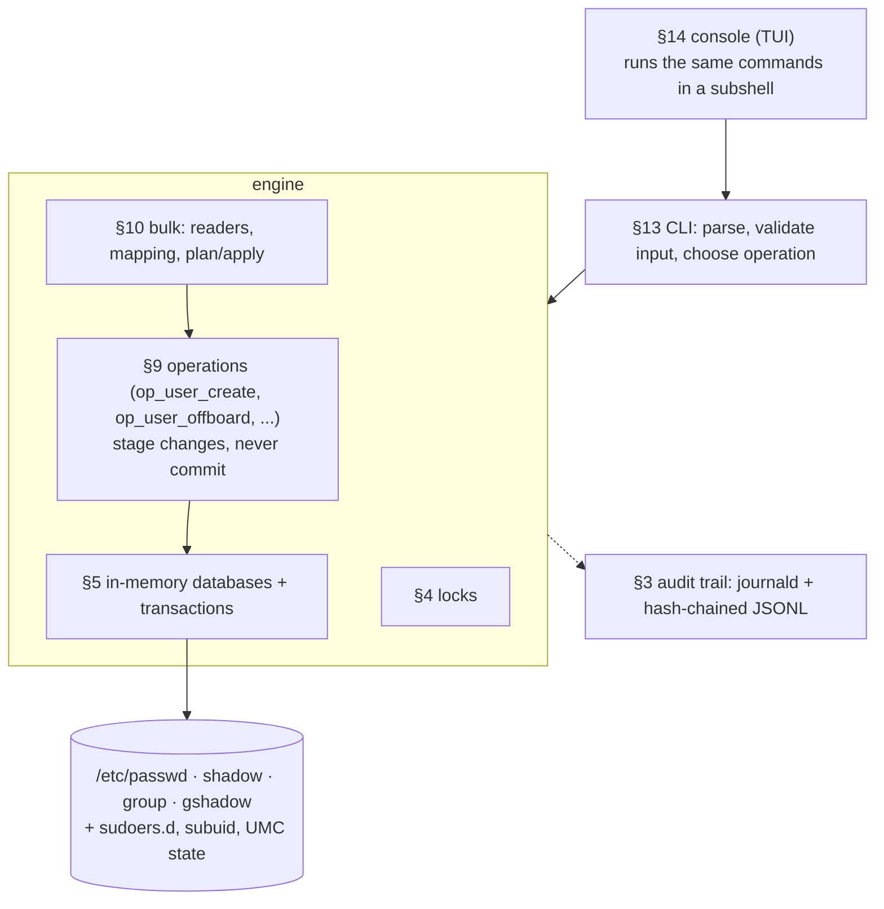
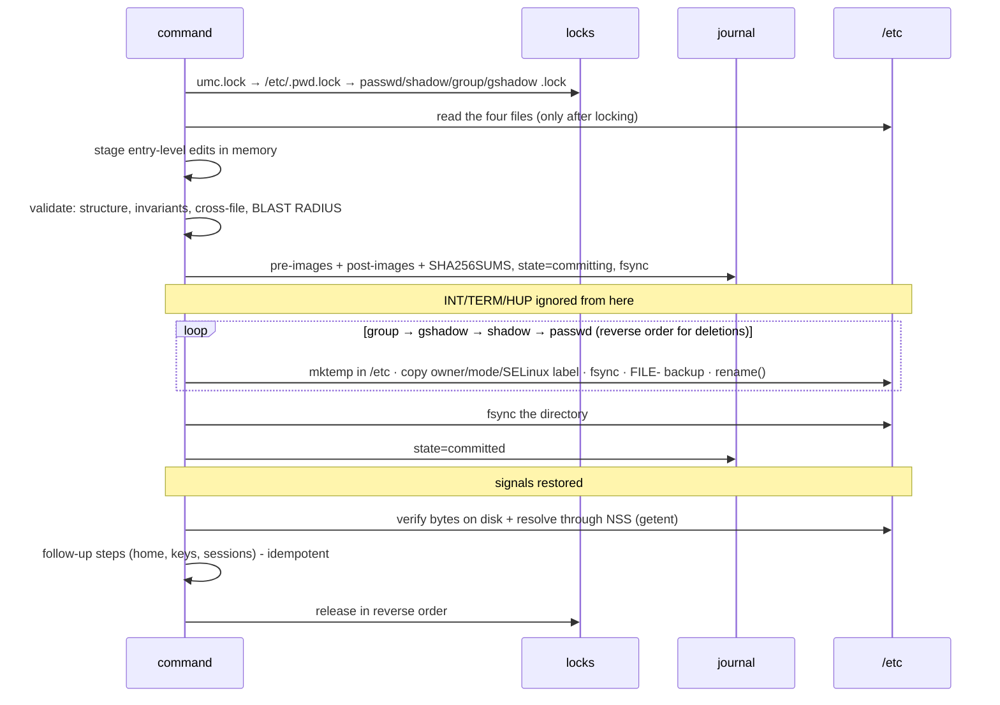

# UMC design notes

This document explains **how** UMC works and **why** it is built this way. It
is written for reviewers, and for the interview question "walk me through a
design decision".

- [1. Goals and non-goals](#1-goals-and-non-goals)
- [2. Architecture: one file, layered](#2-architecture-one-file-layered)
- [3. The commit protocol](#3-the-commit-protocol)
- [4. Locking: two conventions, both honoured](#4-locking-two-conventions-both-honoured)
- [5. Validation and the blast-radius check](#5-validation-and-the-blast-radius-check)
- [6. Journal, rollback and crash recovery](#6-journal-rollback-and-crash-recovery)
- [7. Error-handling contract](#7-error-handling-contract)
- [8. Secrets](#8-secrets)
- [9. Bulk import: guess, show, confirm](#9-bulk-import-guess-show-confirm)
- [10. Onboarding with a deadline](#10-onboarding-with-a-deadline)
- [11. Audit trail](#11-audit-trail)
- [12. Threat model](#12-threat-model)
- [13. Trade-offs and alternatives considered](#13-trade-offs-and-alternatives-considered)
- [14. Bugs the safety nets caught during development](#14-bugs-the-safety-nets-caught-during-development)

---

## 1. Goals and non-goals

**Goals** (kept from v1's original objectives):

| Goal | How |
|---|---|
| One self-contained file | `umc.sh`: copy it to any host, check its hash, run it |
| Independent of `useradd`/`usermod`/`userdel`/`groupadd`/`gpasswd`/`passwd`/`chage`/`chpasswd`/`newusers` | UMC edits `/etc/{passwd,shadow,group,gshadow}` itself |
| Atomic, crash-safe | §3, §6 |
| Idempotent | every operation converges; `apply` twice = 0 changes |
| Bulk | any HR export, one transaction, parallel hashing |
| Auditable, reversible | §6, §11 |
| Works across distros | capability detection instead of distro detection |

**Non-goals.** Human identities in an enterprise belong in AD/FreeIPA with
SSSD. UMC manages *local* accounts: break-glass accounts, service accounts,
air-gapped and OT hosts, appliances, golden images (`--root`), and hosts before
they join a domain. It coexists with SSSD: it never edits directory accounts,
checks NSS for name/ID collisions, and flushes `nscd`/`sssd` caches after a
change. It does not modify PAM stacks.

## 2. Architecture: one file, layered



- **Engine and interface are separate.** In v1 the logic lived inside the
  menus, so nothing could automate or test it. In v2 the console runs exactly
  the commands a script would, and shows the CLI equivalent of every action.
- **Operations never commit.** `op_*` functions stage changes in an open
  transaction. One command, or a 1,000-user `apply`, is **one** transaction:
  all or nothing.
- **Why a 5,800-line single file?** It was an explicit objective, and it is a
  real operational advantage: one artefact to copy to an air-gapped host and
  verify with one checksum. The cost, navigation, is managed with numbered
  sections (`§0`…`§15`), function prefixes (`db_`, `txn_`, `lk_`, `val_`,
  `op_`, `cmd_`, `tui_`) and zero shellcheck findings.

## 3. The commit protocol

Modelled on shadow-utils' `lib/commonio.c`, the code `useradd` itself uses:



Why each step exists:

| Step | Without it |
|---|---|
| temp file **in the target directory** | `rename(2)` is atomic only within one filesystem. From a tmpfs `/tmp` (Debian 13, Fedora, Arch), `mv` degrades to copy + delete. A shared `/tmp` is also where v1's F-01 came from. |
| `mktemp` (O_EXCL, 0600, root) | predictable names can be pre-created by other users |
| copy owner/mode/label | v1's F-02 (`/etc/passwd` became 0600) and wrong SELinux labels |
| fsync file, rename, fsync directory | after a power cut the rename could survive without the data, or not survive at all |
| `FILE-` backup | the convention admins and `pwck` already know (`/etc/shadow-`) |
| order (publish last / unpublish first) | other readers never see a user in `passwd` whose `shadow` entry does not exist yet |
| signals ignored during renames | *ignored* signals are inherited by child processes, so a Ctrl-C cannot kill an `mv` half-way through the sequence. Trapping would not be enough, because trapped signals reset to default in children. |
| verify via NSS | proves the change is visible the way `login` would see it |

## 4. Locking: two conventions, both honoured

| Convention | Used by | UMC |
|---|---|---|
| `FILE.lock` hard-link protocol: write your PID to `FILE.PID`, `link()` it to `FILE.lock`; `link()` fails if the lock exists; a lock whose PID is dead is stale | `useradd`, `usermod`, `passwd`, `chage`, `gpasswd` | implemented with `ln`, including the link-count check and stale-PID handling; never removes a live process's lock |
| `/etc/.pwd.lock` via `lckpwdf(3)`, a POSIX `fcntl()` lock | glibc, **pam_unix** (so `passwd`/`chpasswd` via PAM), `vipw`, `systemd-sysusers` | `flock --fcntl` (util-linux ≥ 2.41); otherwise a tiny python3 or perl helper that holds the same `fcntl` lock for UMC's lifetime |

Locks are acquired in a **fixed order**, the same one shadow-utils uses, so two
tools cannot deadlock. They are taken **before** the files are read. Reading
first and locking later is how v1 could lose concurrent changes (F-13).

**Why the second lock matters, found by testing.** On Debian 12 (util-linux
2.38, no `--fcntl`), the concurrency test ran UMC next to `chpasswd`.
`chpasswd` changes passwords through `pam_unix`, which honours *only*
`/etc/.pwd.lock`. `pam_unix` rewrote `/etc/shadow` during UMC's commit. UMC's
post-commit check detected it, but the automatic rollback would then have
reverted `chpasswd`'s change. Two fixes followed:

1. the python3/perl `fcntl` helper, so the lock is honoured on older util-linux;
2. **UMC never rolls back over someone else's write.** It only rolls back if
   every file is still byte-identical to what UMC wrote. Otherwise it checks
   that its own entries survived and reports honestly.

`umc doctor` shows which method a host uses. Evidence: [E-07](../evidence/E-07-concurrency.md).

## 5. Validation and the blast-radius check

Before anything is written:

1. **Structure.** Every line of every new file is checked (field counts,
   numeric IDs, member-list syntax, duplicates, empty password fields). An
   issue that already existed before is reported by `umc audit` but does not
   block unrelated changes. An issue *introduced* by this transaction is fatal.
2. **Invariants.** Root keeps UID 0; every touched `passwd` entry has a
   `shadow` entry and every touched group a `gshadow` entry; nothing is orphaned.
3. **Blast radius.** Each operation *declares* which entries it may touch
   (`txn_target_user carol`). An independent `awk` pass compares the bytes of
   the old and new file. If any other entry differs, the commit is refused.
   This check does not trust the code that did the editing, which is why it
   caught a real bug (§14). Evidence: [E-10](../evidence/E-10-blast-radius.md).

Input validators reject bad data with a reason and **never silently change
it**. v1 turned `j.doe` into `jdoe` (F-28).

## 6. Journal, rollback and crash recovery

```
/var/lib/umc/txn/<UTC-time>-<pid>-<n>/
    meta          id, actor, action, summary, state (prepared|committing|committed|rolled-back|recovered)
    files         index, path, "mode uid gid"
    pre/  post/   byte-exact images (0600: they contain hashes)
    SHA256SUMS
```

- **Rollback** is a new transaction that installs the pre-images. So it is
  journaled and can itself be rolled back. It refuses if a file changed after
  that transaction (unless `--force`), and it lists what lies outside the
  account files and was *not* reverted (home directories).
- **Crash recovery.** A transaction left in `committing` means UMC was killed
  (SIGKILL, power loss) mid-commit. The next write command, or `umc recover`,
  verifies the journal's checksums and installs the pre-images.
  **Interrupted transactions are rolled back, never left half-applied.**
  Evidence: 300 random SIGKILLs, [E-05](../evidence/E-05-crash-consistency.md);
  disk-full at every point, [E-06](../evidence/E-06-disk-full.md).
- **Stateless by design:** each run re-reads the system. The journal is an
  undo/audit record, never a source of truth.

## 7. Error-handling contract

Bash has no exceptions, so error handling is designed in:

| Rule | Implementation |
|---|---|
| Fail closed | every check happens before the first rename; doubt means stop |
| Three-part messages | `die CODE WHAT STATE NEXT`: what failed · what state the system is in · what to do |
| Honest state | exactly one of: *nothing was changed* · *rolled back automatically* · *committed, a follow-up step failed, safe to re-run* |
| Guaranteed cleanup | `EXIT`/`INT`/`TERM`/`HUP` traps remove temp files, shred unfinished credential slips, release locks in reverse |
| No `set -e` | its rules change inside `if`/`&&`/`\|\|`/functions. Every mutating step is checked explicitly instead; `--debug` traces every failing command with its call stack |
| Idempotent follow-ups | home directories, keys and sessions happen after the commit; re-running the same command only redoes what is missing |
| Documented exit codes | 0 ok · 1 failure · 2 usage · 3 invalid · 4 locked · 5 not found · 6 conflict · 7 integrity · 8 rolled back · 10 audit findings |

## 8. Secrets

- Passwords travel only through **pipes and variables**: never on a command
  line (`ps` shows arguments), never in here-strings (bash < 5.1 backs those
  with temp files), never in logs, journals or `--json` output.
- `--password-stdin` for automation; the console asks twice without echo.
- Hashing honours `ENCRYPT_METHOD` (SHA-512 via `openssl passwd -6`, yescrypt
  via `mkpasswd` when available). Every hash is checked before it is written:
  v1 once wrote openssl's literal `<NULL>` into `/etc/shadow` (F-15).
- Bulk hashing: one `openssl` process per CPU core hashes a whole batch.
- The password policy is read from `pwquality.conf`, which PAM enforces, and
  checked with `pwscore` when installed. `login.defs`' `PASS_MIN_LEN` is
  ignored by PAM; v1's policy menu edited it (F-17).

## 9. Bulk import: guess, show, confirm

HR exports arrive as they are. UMC:

1. **decodes**: UTF-8 BOM, UTF-16 ("Unicode Text"), Windows-1252, CRLF;
2. **detects the delimiter** (`,` `;` tab `|`) by which one gives consistent
   quote-aware field counts;
3. **finds the records** in JSON: the largest array of objects, wherever it is;
   nested keys are flattened;
4. **maps columns** through an alias table (`E-Mail Address` → email,
   `Given Name` → first_name…). Ambiguous headers are decided by content:
   `uid` with numbers is a UID, with names a user name;
5. **derives user names** from the e-mail address or a pattern (`first.last`).
   Accented Latin letters are transliterated; names that cannot be
   transliterated are **flagged, never mangled**;
6. **matches identities** by employee id, then e-mail, then user name, so
   next month's export updates the same accounts even if a surname changed.
   Two different people with the same name get distinct accounts;
7. shows everything with `import inspect` and `plan`, and writes nothing until
   `apply`.

`apply` re-plans under the lock and compares a **fingerprint** of the plan the
admin saw (optimistic concurrency, as with a saved Terraform plan). Imports
are **all-or-nothing**; `--skip-invalid` applies only the valid rows and writes
a rejects report.

*Movers:* UMC revokes only group memberships **it granted** (recorded in its
managed-state file) when rules no longer apply. Manual grants are never
touched. `--prune` offboards only accounts UMC created. Both are deliberate
safety boundaries, and they prevent privilege creep.

## 10. Onboarding with a deadline

The design came from a request to "give HR a default password and delete the
account if it isn't changed in 24 h". It was refined:

| Idea | Decision | Reason |
|---|---|---|
| HR files contain no hashes | kept | HR cannot produce hashes |
| forced change | kept (`lastchg = 0`) | PCI DSS v4.0 req. 8.3.5 |
| 24 h deadline | kept, configurable | limits exposure (cf. Microsoft Entra Temporary Access Pass) |
| one shared default password | **replaced** by a unique random password per user (~70 bits, no look-alike characters) | a shared default plus guessable user names lets anyone claim a new account first; PCI 8.3.5 requires unique first-use values |
| delete at the deadline | **replaced** by lock + report | deletion must be explicit; it would also destroy evidence and recycle the UID |

Enforcement has two layers. The `umc sweep` timer (every 15 min) is exact. The
shadow expiry date is set to the day *after* the deadline, and still works if
the timer never runs. Credential slips are root-only and self-destruct as users
activate or expire. Users with SSH keys get no password at all. Evidence:
[E-15](../evidence/E-15-onboarding-deadline.md).

## 11. Audit trail

- **journald**, with structured fields: `journalctl UMC_ACTION=user.offboard UMC_ACTOR=alice`
- **`/var/log/umc/audit.jsonl`**: each record contains the SHA-256 of the
  previous one. `umc log verify` detects edited, deleted or inserted lines; it
  uses two processes in total (`split` + `sha256sum`) whatever the log size.
- The **actor** is the kernel's `loginuid`, which survives `sudo -i`/`su`, plus
  `SUDO_USER`, the tty and the SSH client address.
- *Honest limit:* root can recompute the whole chain. Forwarding journald off
  the host is the real control. The chain makes tampering *evident*, not
  *impossible*. Evidence: [E-13](../evidence/E-13-tamper-evident-log.md).

## 12. Threat model

| Threat | Mitigation |
|---|---|
| Local user races UMC through shared temp files | no shared temp files (§3); `mktemp` in root-owned directories |
| Local user plants symlinks in their home | writes inside homes run as that user (`setpriv`); symlinks refused |
| Concurrent account tools | both lock conventions (§4); verification never clobbers foreign writes |
| Malicious or malformed input files | allowlist validation; control characters refused; plaintext passwords refused; spreadsheet formula injection neutralised in exports (CWE-1236) |
| Tampered environment | fixed `PATH`, `LC_ALL=C`, `IFS`, `umask 077`; `CDPATH`/`BASH_ENV` unset; `#!/bin/bash` rather than `env` |
| Tampered configuration | `umc.conf` is parsed, never sourced, and must be root-owned and not group/world-writable |
| Tampered script | `umc doctor` warns if `umc.sh` is writable by non-root |
| Admin error | dry run; plan before apply; lockout guards (root, self, last admin, protected accounts); offboard before delete; rollback |
| Crash / disk full | journal + recovery (§6) |

## 13. Trade-offs and alternatives considered

| Decision | Alternative | Why this one |
|---|---|---|
| Bash, one file | Python/Go | an explicit objective; bash exists on every target; no runtime to install on an air-gapped host |
| Own JSON/CSV readers in awk | `jq` | independence objective; also runs on Debian's `mawk`. Cost: about 250 lines of parser that must be tested (unit tests cover escapes, surrogate pairs, errors) |
| In-memory arrays, write once | `sed -i` per change | exact field editing; untouched lines byte-identical; bulk performance |
| Journal of full file images | diffs | the files are small; full images make recovery trivial and verifiable |
| Roll back on crash | roll forward | the follow-up steps have not run yet, so rolling back is always consistent |
| Lock + report at onboarding deadline | delete | reversible, keeps evidence, no UID recycling |
| No `set -e` | `set -Eeuo pipefail` | predictability inside conditionals and functions; explicit checks instead |

## 14. Bugs the safety nets caught during development

These show that the protections are not theoretical. Each became a test:

1. **Blast-radius check vs. `user modify --rename`**: the rename code declared
   only one of the two group entries it changed; the commit was refused.
2. **Live concurrency test vs. PAM**: `chpasswd` through `pam_unix` wrote
   `/etc/shadow` during a commit on a host without `flock --fcntl` (§4).
3. **`pipefail` vs. an empty key list**: `(($#)) && printf …` failed a
   pipeline when there were no keys to pass; offboarding reported a spurious
   failure.
4. **`nounset` everywhere**: several `${array[key],,}` expansions of missing
   keys were caught by `set -o nounset` in the first container run instead of
   silently producing empty strings.
5. **`BASH_REMATCH` clobbering**: `val_date +10` read its capture group after
   calling a helper that ran its own `=~`.
6. **Disk full during the renames** ([E-06](../evidence/E-06-disk-full.md)):
   restoring the old files needed free space too, so only `umc recover` could
   finish the rollback. Originals are now hard-linked to their backup name
   before each rename, so an undo is a `rename()` and needs no space. The same
   run showed that a truncated staging write was only caught (correctly, but
   with a misleading message) by the blast-radius check; every staging write
   is now checked.
7. **A deadlock found by the 1,000-user benchmark**
   ([E-11](../evidence/E-11-performance.md)): parallel home creation ended with
   a bare `wait`, which also waits for the `lckpwdf` helper coprocess, and that
   helper by design lives as long as UMC. It only happened in live mode (sandboxes
   do not take `lckpwdf`) with 16+ homes, so the tests missed it. It now waits
   for its worker PIDs only, and a live test covers the path.
8. **Profiling instead of guessing:** the first benchmark was *slower* than a
   `useradd` loop. Profiling showed one small state file per user going through
   the full commit protocol (~10 processes each). UMC's own state became one
   table per kind, NSS checks and verification became one `getent` call per
   batch, and homes are created in parallel.
9. **A lesson from the evidence scripts themselves:** `set -o pipefail` plus
   `grep -q` (or `head`) can report failure because `grep` exits early and the
   writer gets `SIGPIPE`. In a checker, that can also *hide* a problem. Output
   is now captured first and searched afterwards.
10. **Locale-dependent regular expressions** (F-33): v1's password rule
    `[\,\.\+\-$…]` only works where collation happens to make `\`–`$` a valid
    range. `LC_ALL=C` everywhere, and no ranges between punctuation.
